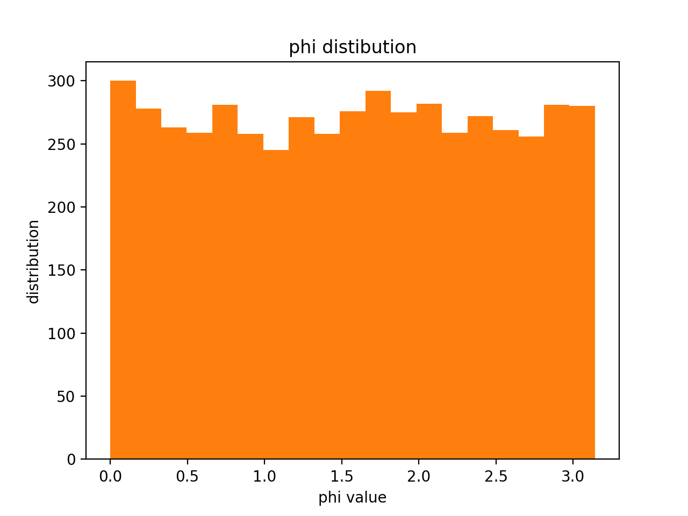
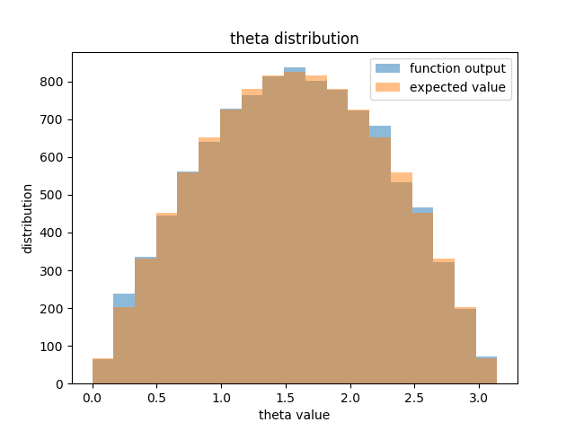
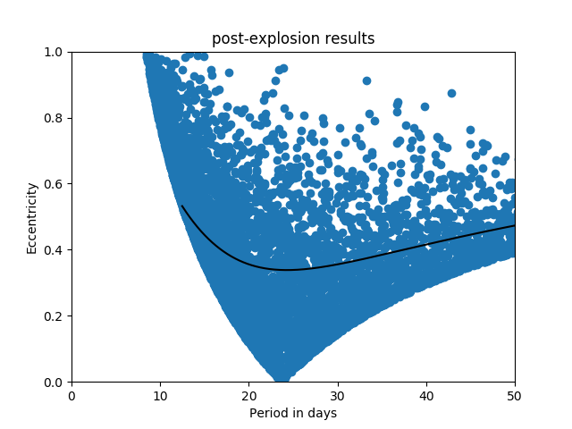

# utils tests

##kicks

I created a series of functions that randomly sample vaules to create both the kick magnitude and direction. The first is rand_phi() which samples the spherical coordinate phi from 0 to 2pi. The second is rand_theta() which samples the spherical coordinate theta from 0 to pi. The last is rand_velocity(sigma) which accepts a value sigma and returns a random velocity sampled from a maxwellian distribution.
```  
rand_velocity = maxwell.isf(rd.random(), 0, scale = sigma)
return rand_velocity
```

The other function I created is a function that accepts initial conditions on a circular binary system and returns the final conditions on the system post super nova.
```
post_explosion_params_circular(Ai, M1, M2, M1f, theta, phi, Vk)
return Af/Rsun, e, theta_new, unbound
```
### test kicks

I created a series of tests that compare the distributions created from sampling the functions in kicks.py to what we expect the distributions to be.

```
test_rand_phi(num_sample=10000, nbins=20, tolerance = 1e-3, seed="Jean", plot=False, save=True)
```



```
test_rand_theta(num_sample=10000, nbins=20, tolerance = 1e-3, seed="Jubilee", plot=False, save=True)
```



```
test_rand_velocity(sigma, num_sample=10000, nbins=20, tolerance=1e-3, seed="Dimitris", plot=False, save=True)
```
.png)


```
testing_circular_function_graph(test_sigma = 100, test_M1 = 5.5, test_M2 = 55, test_Ai = 133, test_Mns = 1.4, seed="Flay",sample_velocity = 100, npoints =10000, plot=False, save =True)
```


I also created a function that tests the post_explosion_params_circular function by comparing the momentum calculated from that fuction, to a momentum calculated from other known values
```
testing_circular_function_momentum(Ai=133, M1=5.5, M2=55, Mns=1.4, test_sigma=100, num_sample=1000, 
seed = "Lela", tolerance=1e-3)
```
