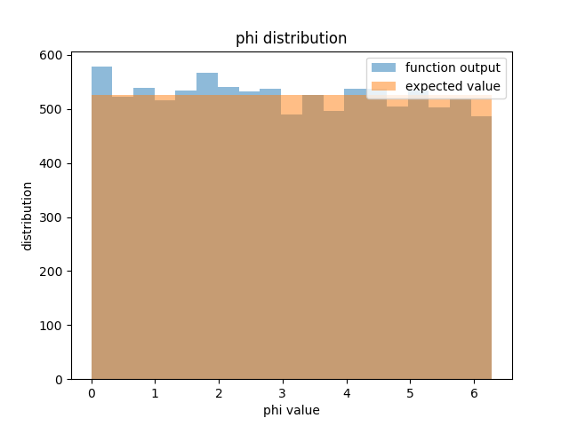

# utils tests

##kicks

I created a series of functions that randomly sample vaules to create both the kick magnitude and direction. The first is rand_phi() which samples the spherical coordinate phi from 0 to 2pi. The second is rand_theta() which samples the spherical coordinate theta from 0 to pi. The last is rand_velocity(sigma) which accepts a value sigma and returns a random velocity sampled from a maxwellian distribution.
```  
rand_velocity = maxwell.isf(rd.random(), 0, scale = sigma)
return rand_velocity
```

Anther function I created is a function that accepts initial conditions on a circular binary system and returns the final conditions on the system post super nova.
```
post_explosion_params_circular(Ai, M1, M2, M1f, theta, phi, Vk)
return Af/Rsun, e, theta_new, unbound
```

I also created a series of functions related to sampling an eccentric system with a kick. The first function finds the true anomaly of the system, then the second uses that true anomaly to find the separation of the system.
```
def rand_separation(e, Ai):
    u = rand_true_anomaly(e)
    separation = Ai*(1 - e**2)/(1+e*np.cos(u))
    
return separation
```

The last part of the eccentric series is a function that accepts the initial contitions of an eccentric system, then returns the system post super nova.
```
post_explosion_params_general( Ai, M1, M2, Mns, e, theta, phi, Vk, true_anomaly)
return Af/Rsun, e_final, bound
```

### test kicks

I created a series of tests that compare the distributions created from sampling the functions in kicks.py to what we expect the distributions to be.

```
test_rand_phi(num_sample=10000, nbins=20, tolerance = 1e-3, seed="Jean", plot=False, save=True)
```



```
test_rand_theta(num_sample=10000, nbins=20, tolerance = 1e-3, seed="Jubilee", plot=False, save=True)
```


```
test_rand_velocity(sigma, num_sample=10000, nbins=20, tolerance=1e-3, seed="Dimitris", plot=False, save=True)
```
.png)

```
test_rand_true_anomaly(e,num_sample=10000, nbins=20, tolerance = 1e-3, seed="Rhysand", plot=False, save=True)
```


```
testing_circular_function_graph(test_sigma = 100, test_M1 = 5.5, test_M2 = 55, test_Ai = 133, test_Mns = 1.4, seed="Flay",sample_velocity = 100, npoints =10000, plot=False, save =True)
```


I also created a function that tests the post_explosion_params_circular function by comparing the momentum calculated from that fuction, to a momentum calculated from other known values
```
testing_circular_function_momentum(Ai=133, M1=5.5, M2=55, Mns=1.4, test_sigma=100, num_sample=1000, 
seed = "Lela", tolerance=1e-3)
```

A second version of the momentum test and the graph test were needed after the post_explosion_params_general function was created to test that function. These slightly modified functions accept the post_explosion_params_general function with an intial eccentricity of zero. the results they produce are very similar to the original circular tests.

Another function was created to test the post_explosion_params_general function. This function calculates the kick needed to force the eccentric system into a circular one then plugs those results into post_explosion_params_general to make sure the end eccentricity is zero.
```
testing_eccentric_kick(Ai=133, M1=5.5, M2=55, Mns=1.4, num_sample=100, seed = "Guarnaschelli")
  if e_a > 1e-4 or e_p > 1e-4:
    return False
```
An additional test was created for the post_explosions_params_general function that kicks a circular system with mass loss, then reverses that with mass gain back into a circular orbit
```
testing_inverse_kick(Ai=133, M1=5.5, M2=55, Mns=1.4, test_sigma=1000, num_sample=100, seed="Tamlin",tolerance=1e-4)

 semi_major_i, e_i, boulean_i = kicks.post_explosion_params_general(Ai,M1,M2,Mns,0,theta,0,V_kick,0)
 k = semi_major_i*(1-e_i**2)/(e_i*Ai) - 1/e_i       
 true_anomaly = np.arccos(k)       
semi_major_f, e_f, boulean_f = kicks.post_explosion_params_general(semi_major_i,Mns,M2,M1,e_i,np.pi-theta,np.pi,V_kick,true_anomaly)
```

A full version of the momentum test was also created to test the post_explosion_params_general in the case of an initial eccentric orbit.
The momentum is calculated in a slightly different method from the previous momentum funcitons.
```
testing_momentum_full_eccentric(Ai=133, M1=5.5, M2=55, Mns=1.4, test_sigma=15, num_sample=100, seed="Lucien",tolerance=1e-4
 if abs(Momentum_function - Momentum_calculated)/Momentum_function>tolerance:
     print(Vk, theta, phi, true_anomaly, Momentum_calculated, Momentum_function, e)
     return False
```

####Run Tests

This is a file that runs all the tests in the test_kicks file at once and saves any graphs that are created in the process
